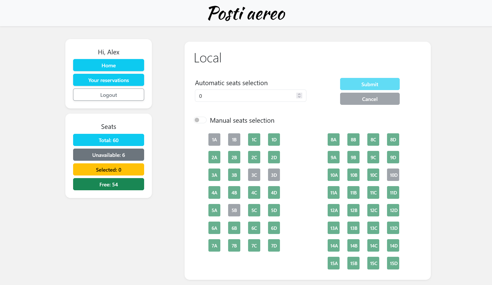

A simple web app built using React and Express made for the Web Application I exam at Politecnico di Torino.

## React Client Application Routes

- Route `/`: homepage (airplanes list)
- Route `/airplane/:airplaneId`: airplane info and form to make a reservation
- Route `/your-reservations`: list of reservations the user made
- Route `/login`: login form
- Route `*`: not found page

## API Server
### Autenticazione
- POST `/api/sessions`
  - allows a user to authenticate
  - if successful returns a json with user info
- DELETE `/api/sessions/current`
  - logout
- GET `/api/sessions/current`
  - check whether the user is logged in or not
  - return error 401 if the user is not authenticated

### Altre
- GET `/api/airplanes`
  - returns a json with an array of airplane objects like: ```{id, type}```
- GET `/api/airplanes/:id`
  - returns a json with an object like:
    ```
    {id, type, nRows, seatsPerRow, [reservedSeats]}
    ```
- POST `/api/airplanes/<id>/reservations`
  - make new reservations for the user for the specified airplane
  - receives an array of seat object like: ```{rowNumber, seatNumber}```
- DELETE `/api/airplanes/<id>/reservations`
  - delete all the reserved seats for the user for the specified airplane
- GET `/api/reservations/`
  - get all the reservations made by the user
  - returns an array of objects like:
    ```
    {airplaneId, type, [reservedSeats]}
    ```

## Database Tables

- Table `airplanes` : (id | type | nRows | seatsPerRow)
- Table `reservations` : (id | airplaneId | userId | rowNumber | seatNumber)
- Table `users` : (id | email | name | salt | password)

## Main React Components

- `HomePage` (in `Homepage.jsx`): shows the airplanes list
- `AirplanePage` (in `AirplanePage.jsx`): shows the airplane info and allows authenticated users to make a reservation
- `ReservationsPage` (in `ReservationsPage.jsx`): shows the user's reservations and allows the user to delete them
- `Sidebar` (in `Sidebar.jsx`): shows navigations buttons, authenticated user info and airplane seats availability info

## Screenshot



## Users Credentials

- user1@test.com, pwd (user with reservations)
- user2@test.com, pwd (user with reservations)
- user3@test.com, pwd
- user4@test.com, pwd

